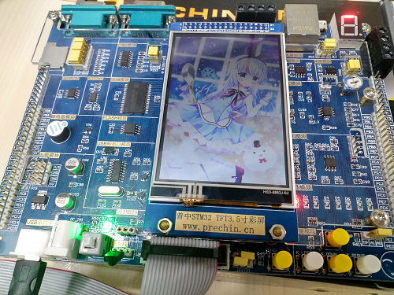

chino-os
===
[English](README.md) | [中文文档](README-zh.md)

[](https://travis-ci.org/chino-os/chino-os) [](https://ci.appveyor.com/project/sunnycase/chino-os)



## Introduction

`chino` is a real time operating system written in C++, which is designed for the [IoT](https://en.wikipedia.org/wiki/Internet_of_things).

## Features

- Multitasking
- Dynamic linking
- Supports many architecture
- Supports developing & debugging on Windows

## Supported Archs & Boards

Architecture  | Board           | Firmware Type |
------------- | ----------------|----------------
win-x86_64    | win32-simulator | exe           |
x86_64		  | pc			    | iso           |
cortex-m3	  | stm32f103rc     | hex           |

## Build

### For Win32-Simulator

1. Rename `CMakeSettings-template.json` to `CMakeSettings.json`.
2. Open root directory in Visual Studio 2017 or higher.
3. Generate CMake cache and build `kernel.exe`.

### For Others

1. Downloads [chino-gnu-toolchain-preview3.tar.gz](https://github.com/chino-os/chino-gnu-toolchain/releases/download/preview3/chino-gnu-toolchain-preview3.tar.gz) and extracts to `/opt/` directory
```bash
wget https://github.com/chino-os/chino-gnu-toolchain/releases/download/preview3/chino-gnu-toolchain-preview3.tar.gz
sudo tar xvzf chino-gnu-toolchain-preview3.tar.gz /opt/
```
2. Installs dependencies
```bash
git clone git://git.code.sf.net/p/gnu-efi/code gnu-efi-code
cd gnu-efi-code
make && sudo make install
sudo apt install device-tree-compiler xorriso cmake -y
```
3. Clones source and builds
```bash
git clone https://github.com/chino-os/chino-os.git
mkdir build && cd build
../build.sh <arch> <board>
make firmware
```

## Run

### For exe
1. Just run `kernel.exe` (build_i/src/kernel/Debug/kernel.exe).

### For iso firmware
1. Downloads [VirtualBox](https://www.virtualbox.org/wiki/Downloads) and runs.
2. `File` -> `Import Application`, imports `Chino.ova` which is in `chino-os/vms/` directory.
3. `Settings` -> `storage`, chooses the `empty` device and imports the `firmware.iso` just generated in the `build` directory.
4. `Start`.

### For hex firmware
1. Download `kernel.hex` to your board.
2. Reset your board.

## [License (MIT)](https://raw.githubusercontent.com/chino-os/chino-os/master/LICENSE)

	MIT License

	Copyright (c) 2018 chino-os

	Permission is hereby granted, free of charge, to any person obtaining a copy
	of this software and associated documentation files (the "Software"), to deal
	in the Software without restriction, including without limitation the rights
	to use, copy, modify, merge, publish, distribute, sublicense, and/or sell
	copies of the Software, and to permit persons to whom the Software is
	furnished to do so, subject to the following conditions:

	The above copyright notice and this permission notice shall be included in all
	copies or substantial portions of the Software.

	THE SOFTWARE IS PROVIDED "AS IS", WITHOUT WARRANTY OF ANY KIND, EXPRESS OR
	IMPLIED, INCLUDING BUT NOT LIMITED TO THE WARRANTIES OF MERCHANTABILITY,
	FITNESS FOR A PARTICULAR PURPOSE AND NONINFRINGEMENT. IN NO EVENT SHALL THE
	AUTHORS OR COPYRIGHT HOLDERS BE LIABLE FOR ANY CLAIM, DAMAGES OR OTHER
	LIABILITY, WHETHER IN AN ACTION OF CONTRACT, TORT OR OTHERWISE, ARISING FROM,
	OUT OF OR IN CONNECTION WITH THE SOFTWARE OR THE USE OR OTHER DEALINGS IN THE
	SOFTWARE.
